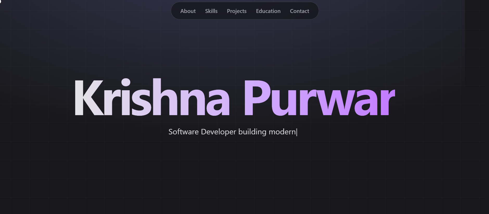

# Krishna Purwar - Personal Portfolio

[](https://nextjs.org/)
[](https://react.dev/)
[](https://tailwindcss.com/)
[](https://www.framer.com/motion/)

Welcome to the code repository for my personal portfolio. This is a fully dynamic, "techy & futuristic" site built from scratch to showcase my skills, projects, and passion for modern web development.

### [**View Live Site**](https://rukrishna.vercel.app) 🚀




---

## About This Project

As a first-year MCA student at NIT Jamshedpur, I wanted to build more than just a static resume. This portfolio is a living project that demonstrates my abilities with a modern, full-stack-ready tech stack.

The goal was to create a "techy and futuristic" vibe that reflects my passion for building intelligent and beautiful applications.

## Core Features

This isn't just a simple HTML/CSS page. The site is a full Next.js application packed with modern, high-performance features.

* **Dynamic Hero:** A fully interactive hero section with:
    * **3D Parallax Effect:** The background grid and foreground text move at different speeds based on the user's mouse, creating an illusion of depth (built with Framer Motion `useTransform`).
    * **Infinite Typing Effect:** The tagline loops through multiple phrases with a "typing" animation, built with React Hooks.
    * **Flowing S-Wave Divider:** A custom, full-width SVG "S-wave" with a seamless `wave-horizontal-flow` animation provides a smooth transition between sections.
* **"Glassmorphism" UI:** The header and all project/education cards use a "frosted glass" (`backdrop-blur-lg`) effect with a "shining" animated background.
* **Reactive Custom Cursor:** A custom-built cursor that emits "star" particles as it moves. This is built with Framer Motion and `useVelocity` to track mouse speed.
* **Staggered "On-Scroll" Animations:** Every section and item on the page gracefully fades in and slides up as you scroll, using Framer Motion's `whileInView` and `staggerChildren` for a polished feel.
* **Oblique Flowing Skills:** The "My Tech Stack" section features animated, diagonally-scrolling rows of skill icons (with their official brand colors) to create a dynamic, "cross-flow" effect.
* **Modern Fonts:** Uses "JetBrains Mono" for techy headings and "Inter" for clean, readable body text, all loaded via `next/font`.
* **100% Responsive:** Designed from the ground up to be perfectly usable and beautiful on all devices, from mobile to desktop.

## Tech Stack

* **Framework:** Next.js 14 (App Router)
* **Language:** TypeScript
* **Styling:** Tailwind CSS
* **UI Components:** `shadcn/ui`
* **Animation:** Framer Motion
* **Icons:** `react-icons`, `lucide-react`
* **Deployment:** Vercel (with instant "push-to-deploy" CI/CD)

## How to Run Locally

1.  **Clone the repository:**
    ```bash
    git clone [https://github.com/](https://github.com/)[YOUR_USERNAME]/[YOUR_REPO_NAME].git
    ```

2.  **Navigate to the project directory:**
    ```bash
    cd [YOUR_REPO_NAME]
    ```

3.  **Install dependencies:**
    ```bash
    npm install
    ```

4.  **Run the development server:**
    ```bash
    npm run dev
    ```

Open [http://localhost:3000](http://localhost:3000) with your browser to see the result.